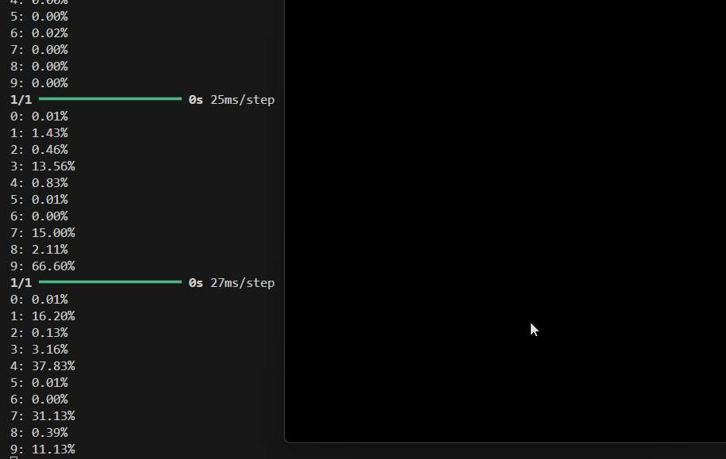

# NumbersAI

Used pygame to draw.
Used tensorflow to train images and test the board.

### Left-Click : paint
### Del : clear screen
### C : test number
### 1 : increase pencil size
### 2 : decrease pencil size

